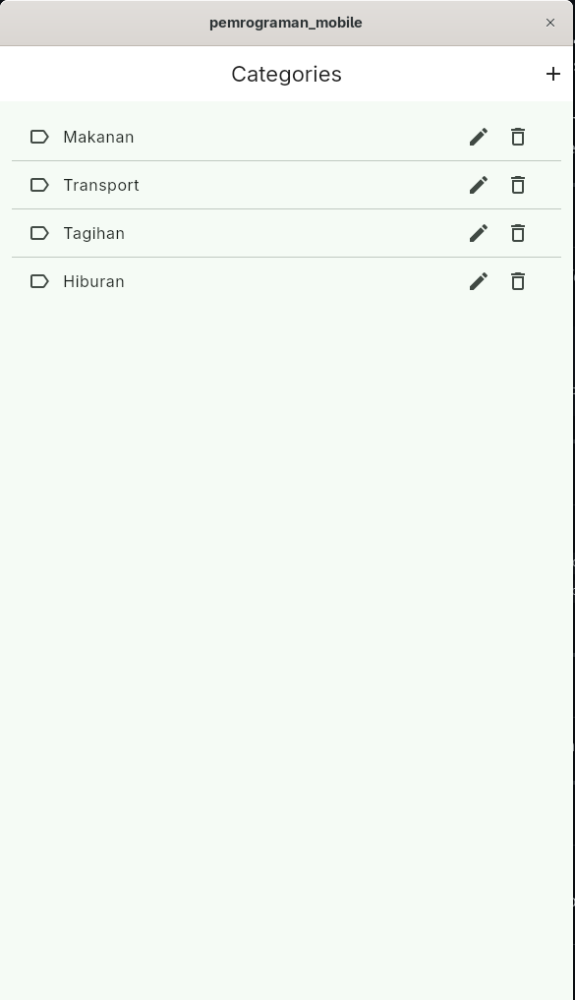
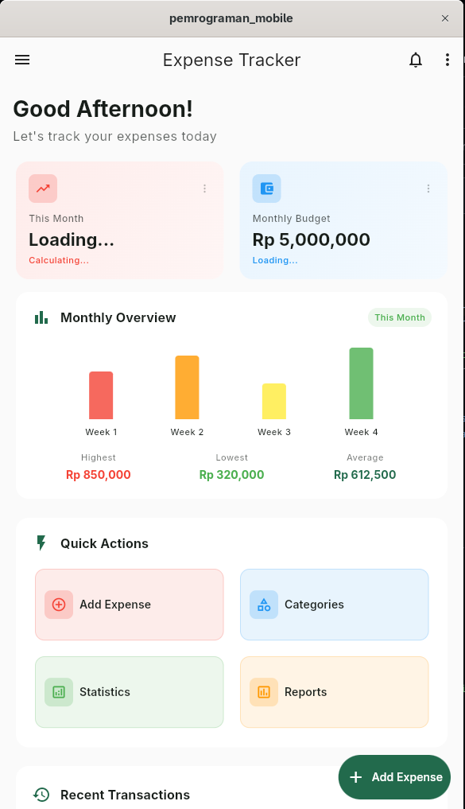
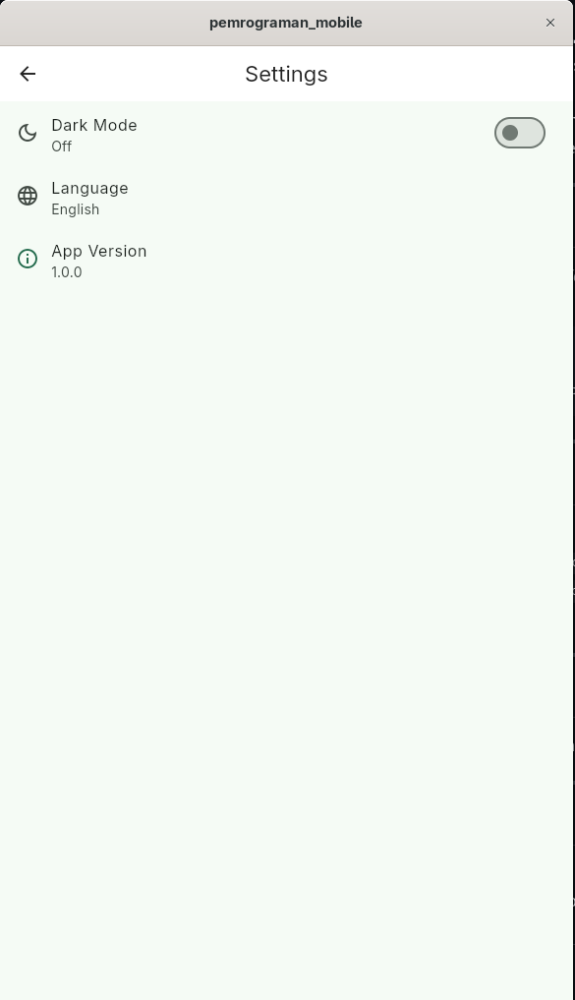
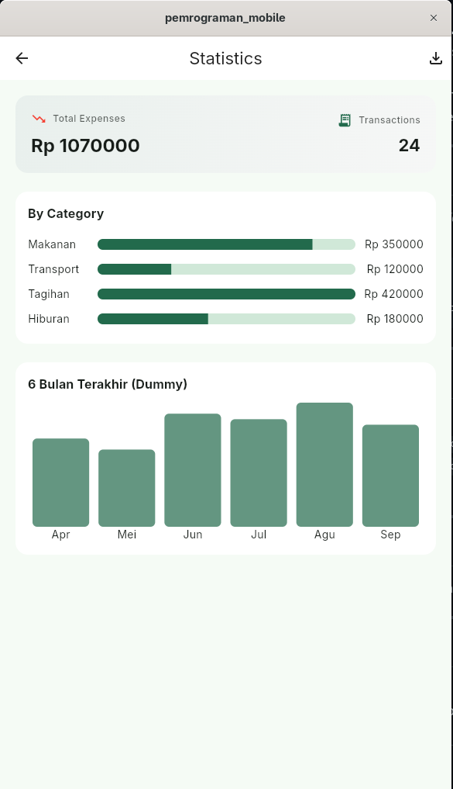

# pemrograman_mobile

A Flutter starter app for the **Mobile Programming — Individual Project 3G** assignment (created via GitHub Classroom).  
This repository includes multi-platform scaffolding (Android, iOS, Web, Windows, macOS, Linux) and a basic Flutter app structure to build upon.

**Author:** Moch. Naufal Ardian Ramadhan (NIM: 2341760148)

---

## ✨ Features (current / planned)

- [ ] Clean project structure (`lib/`, `test/`, platform folders)
- [ ] Basic navigation sample
- [ ] Theming with Material 3
- [ ] State management (choose one: Provider / Riverpod / BLoC)
- [ ] Local storage (SharedPreferences / Hive)
- [ ] API client sample (Dio / http)
- [ ] Unit & widget tests

> Tip: check items as you implement them to track progress.

---

## 🧱 Project Structure

```
.
├─ lib/
│  ├─ main.dart              # App entrypoint
│  ├─ src/                   # (recommended) your app modules
│  │  ├─ features/
│  │  ├─ common/
│  │  └─ core/
├─ test/                     # Unit & widget tests
├─ android/ ios/ macos/      # Native platform configs
├─ linux/ windows/ web/      # Desktop & web targets
├─ pubspec.yaml              # Dependencies & assets
└─ analysis_options.yaml     # Lints & static analysis
```

---

## 🛠️ Prerequisites

- Flutter SDK (stable channel)
- Dart (bundled with Flutter)
- Android Studio / Xcode (for mobile)
- Chrome (for Flutter Web)

Check your setup:

```bash
flutter --version
flutter doctor
```

---

## ▶️ Getting Started

Install dependencies:

```bash
flutter pub get
```

Run on a device / emulator:

```bash
# List devices
flutter devices

# Run (pick one device ID if needed)
flutter run
```

Run on the web:

```bash
flutter run -d chrome
```

---

## 🧪 Testing & Linting

Run tests:

```bash
flutter test
```

Run analyzer (fix issues early):

```bash
flutter analyze
```

Format code:

```bash
dart format .
```

---

## 📦 Build Artifacts

Android (APK, debug):

```bash
flutter build apk --debug
```

Android (APK, release):

```bash
flutter build apk --release
```

Web (release):

```bash
flutter build web
```

iOS (release – requires macOS/Xcode):

```bash
flutter build ios --release
```

---

## 🗺️ Roadmap Ideas

- [ ] Authentication flow (login/register)
- [ ] Feature modules (e.g., lessons, profile, settings)
- [ ] API integration & error handling
- [ ] Offline cache for web & mobile
- [ ] CI (GitHub Actions) for test & build

---

## 📸 Screenshots
<p align="center">
  <table>
    <tr>
      <td></td>
      <td></td>
    </tr>
  </table>

  <table>
    <tr>
      <td></td>
      <td></td>
    </tr>
  </table>
</p>


## 🤝 Contributing

1. Create a feature branch: `git checkout -b feat/<feature-name>`
2. Commit changes: `git commit -m "feat: ..."`
3. Push branch: `git push origin feat/<feature-name>`
4. Open a Pull Request

---

## 📄 License

MIT — feel free to use and modify for learning purposes.

---

## 🙌 Acknowledgements

- Flutter team & docs
- Course starter by GitHub Classroom
